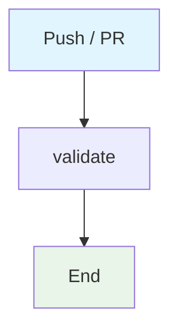

## Workflow Overview

**Purpose**: Frozen-lockfile install, lint, typecheck, and production build.
**Trigger Events**: Push and pull requests to main/master.
**Target Environments**: Ephemeral Ubuntu CI.

## Execution Flow Diagram

## Jobs & Dependencies

| Job Name | Purpose | Dependencies | Execution Context |
|---|---|---|---|
| validate | pnpm install + lint + typecheck + build | none | ubuntu-latest / Node 20 / pnpm 10 |

## Requirements Matrix

| ID | Requirement | Priority | Acceptance Criteria |
|---|---|---|---|
| REQ-001 | Lockfile is authoritative | High | `--frozen-lockfile` |
| REQ-002 | Lint, typecheck, and build must pass | High | Each script exits 0 |
| SEC-001 | Contents read only | High | `permissions.contents: read` |

## Secrets & Variables

None.

## Change Management

| Version | Date | Changes | Author |
|---|---|---|---|
| 1.0 | 2026-08-23 | Initial specification | fleet audit |
