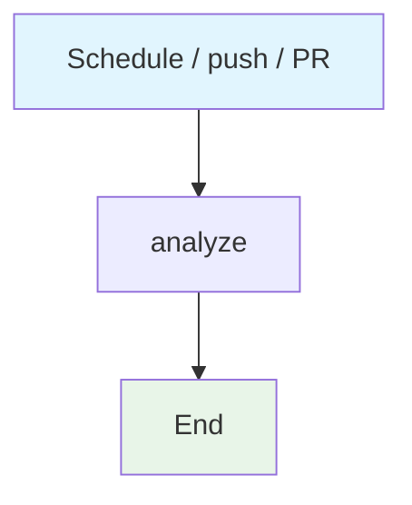

## Workflow Overview

**Purpose**: Copied CodeQL analysis template for javascript/python.
**Trigger Events**: Daily 02:00 UTC; push to main/master; pull requests.
**Target Environments**: Ephemeral Ubuntu CI.

## Execution Flow Diagram

## Jobs & Dependencies

| Job Name | Purpose | Dependencies | Execution Context |
|---|---|---|---|
| analyze | CodeQL init/autobuild/analyze | none | ubuntu-latest |

## Requirements Matrix

| ID | Requirement | Priority | Acceptance Criteria |
|---|---|---|---|
| REQ-001 | Scan configured languages | Medium | Init + analyze complete |
| SEC-001 | No extra credentials | High | Uses default GitHub token only |

## Notes

This is a copied fleet template. Language matrix should be narrowed if the repo is not polyglot.

## Change Management

| Version | Date | Changes | Author |
|---|---|---|---|
| 1.0 | 2026-08-23 | Initial specification | fleet audit |
