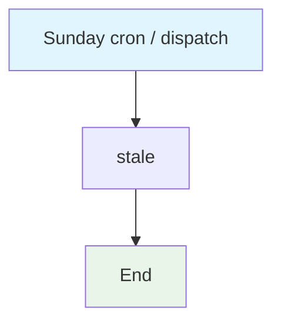

## Workflow Overview

**Purpose**: Weekly stale marking of inactive issues and PRs.
**Trigger Events**: Sunday 03:00 UTC; manual dispatch.
**Target Environments**: GitHub issues and pull requests.

## Execution Flow Diagram

## Jobs & Dependencies

| Job Name | Purpose | Dependencies | Execution Context |
|---|---|---|---|
| stale | Label inactive issues/PRs | none | ubuntu-latest |

## Secrets & Variables

| Type | Name | Purpose | Scope |
|---|---|---|---|
| Secret | GITHUB_TOKEN | actions/stale | Workflow |

## Change Management

| Version | Date | Changes | Author |
|---|---|---|---|
| 1.0 | 2026-08-23 | Initial specification | fleet audit |
